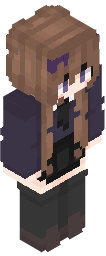
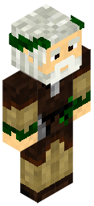

# Serverless Skin Renderer

A serverless 3D Minecraft skin previewer, designed for [Deno Deploy](https://deno.com/deploy). Inspired by [Crafatar](https://github.com/crafatar/crafatar), built using [deno-canvas](https://deno.land/x/canvas@v1.4.2). It supports multiple different url rendering modes, shown below.

## URL Parameters

- `uuid` - The UUID of the player to render the skin of.
- `url` - The url to the skin file to render
- `slim` - If `true` the skin will be rendered with 3 pixel wide arms.
- `scale` - The scale at which to render the skin.

## Fullbody Examples

Endpoint `/full`

   

## Head Examples

Endpoint `/head`

   

## Avatar Examples

Endpoint `/avatar`

   
